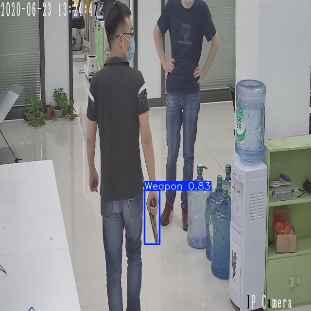
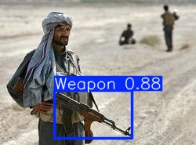
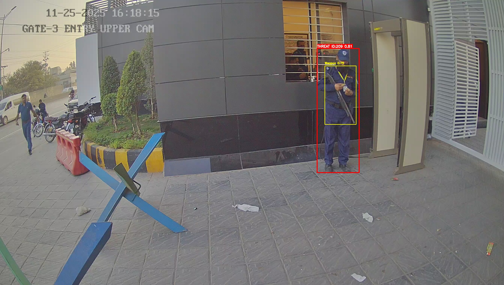

# 🔫 Real-Time Weapon Detection System

<div align="center">


**Proactive Intelligent Surveillance Using Deep Learning and Computer Vision**

[Features](#-key-features) • [Demo](#-demo) • [Performance](#-model-performance) • [Installation](#-installation) • [Usage](#-usage) • [Applications](#-applications)

</div>

---

## 🎯 Overview

This repository presents a **state-of-the-art weapon detection system** designed for intelligent video surveillance, capable of detecting **handguns, rifles, knives**, and other weapons in real-time from live video streams and recorded footage.

Traditional surveillance systems are **reactive**—they record incidents but cannot prevent them. This system transforms surveillance into a **proactive safety tool** by automatically detecting weapons and enabling instant alerts, potentially saving lives.

### 🚨 Why Weapon Detection Matters

- 🏫 **Schools & Universities**: Early threat detection in educational institutions
- 🏢 **Corporate Offices**: Enhanced workplace security
- 🛍️ **Shopping Malls**: Public safety in crowded spaces
- ✈️ **Airports & Transport Hubs**: Critical infrastructure protection
- 🏙️ **Smart Cities**: AI-powered urban security networks

---

## ✨ Key Features

<table>
  <tr>
    <td align="center">🎯</td>
    <td><b>Multi-Weapon Detection</b><br/>Detects guns, AK47, shotguns, </td>
    <td align="center">⚡</td>
    <td><b>Real-Time Processing</b><br/>7-26ms inference time per frame</td>
  </tr>
  <tr>
    <td align="center">📹</td>
    <td><b>Multiple Input Sources</b><br/>CCTV, RTSP streams, video files, webcams</td>
    <td align="center">🔌</td>
    <td><b>Easy Integration</b><br/>REST API, webhooks, alarm systems</td>
  </tr>
  <tr>
    <td align="center">🚀</td>
    <td><b>Edge Deployment Ready</b><br/>Optimized for Jetson, RPI, and edge devices</td>
    <td align="center">📊</td>
    <td><b>Low False Alarm Rate</b><br/>Precision up to 80% with YOLO</td>
  </tr>
  <tr>
    <td align="center">🔄</td>
    <td><b>Scalable Architecture</b><br/>Multi-camera support, distributed processing</td>
    <td align="center">🛡️</td>
    <td><b>Privacy-Preserving</b><br/>No facial recognition, object-based only</td>
  </tr>
</table>

---

## 🚀 Demo

### 🖼️ Detection on Images

<p align="center">
  
  
</p>

<p align="center">
  
  
</p>

**Capabilities:**
- Frame-by-frame weapon detection
- Bounding box annotations with confidence scores
- Integration with alarm systems and dashboards
- Real-time alerts to security control rooms

---

## 🧠 Model Architecture

### Evaluated Models

We evaluated multiple state-of-the-art object detection architectures optimized for surveillance-specific requirements:

| Model | Architecture | Key Strength |
|-------|-------------|--------------|
| **YOLOv8m** | Anchor-free, single-stage | Best speed-accuracy balance |
| **YOLOv9m** | Programmable Gradient Info | Improved feature extraction |
| **YOLOv10m/l** | Dual assignments, NMS-free | Ultra-low latency |
| **RT-DETR** | Transformer-based | Highest accuracy |

### 🎯 Design Requirements

✅ **Small Object Detection** - Weapons can be far from camera  
✅ **Occlusion Handling** - Partial visibility scenarios  
✅ **Low False Alarm Rate** - Critical for public safety  
✅ **Real-Time Inference** - <30ms for actionable alerts  
✅ **Diverse Conditions** - Various lighting, angles, backgrounds

---

## 📊 Model Performance

### 🏆 Comprehensive Comparison

<div align="center">

| Model | Precision | Recall | mAP@50 | Inference Time | Verdict |
|-------|-----------|--------|--------|----------------|---------|
| **RT-DETR** | **0.933** ⭐ | 0.561 | 0.672 | 26.5 ms | Best Accuracy |
| **YOLOv8m** | 0.545 | 0.577 | 0.582 | **7.0 ms** ⚡ | Fastest |
| **YOLOv9m** | 0.612 | 0.541 | 0.573 | 11.2 ms | Good Balance |
| **YOLOv10m** | **0.975** ⭐ | 0.308 | 0.554 | 9.1 ms | Highest Precision |
| **YOLOv10l** | 0.821 | 0.486 | 0.569 | 9.0 ms | **Recommended** 🎯 |

</div>

### 🎯 Model Selection Guide

```
┌─────────────────────────────────────────────────────────┐
│  Use Case Recommendations                                │
├─────────────────────────────────────────────────────────┤
│  🎯 Forensic Analysis     → RT-DETR (highest accuracy)   │
│  ⚡ Real-Time Surveillance → YOLOv10l (best balance)     │
│  🚀 Edge Devices          → YOLOv8m (fastest)           │
│  🎚️ High Precision Needed → YOLOv10m (lowest false +)   │
└─────────────────────────────────────────────────────────┘
```

### 📈 Performance Metrics

- **Precision**: Up to **97.5%** (YOLOv10m)
- **Recall**: Up to **57.7%** (YOLOv8m)
- **mAP@50**: Up to **67.2%** (RT-DETR)
- **Inference Speed**: As low as **7.0ms** (YOLOv8m)
- **FPS**: Up to **143 FPS** on high-end GPUs

---

## 🗂️ Dataset

### Dataset Composition

Our curated weapon detection dataset includes:

| Category | Samples | Description |
|----------|---------|-------------|
| **Handguns** | 20,000+ | Various pistol types and orientations |
| **Ak47** | 10,000+ | Long guns, assault rifles, hunting rifles |
| **Shotguns** | 2000+ | Bats, clubs, swords |
| **Negative Samples** | 5,000+ | Common objects (phones, tools, etc.) |

### Dataset Characteristics

✅ **Real-world CCTV scenarios**  
✅ **Diverse lighting conditions** (day, night, indoor, outdoor)  
✅ **Multiple viewpoints** (front, side, angled)  
✅ **Occlusion cases** (partial visibility)  
✅ **Balanced negative samples** (reduces false alarms)

### 📁 Directory Structure

```
dataset/
├── images/
│   ├── train/          # Training images
│   ├── val/            # Validation images
│   └── test/           # Test images
└── labels/
    ├── train/          # YOLO format annotations
    ├── val/            # Validation labels
    └── test/           # Test labels
```

**📥 Dataset Access**: The complete dataset is available upon request for research and security applications. Contact for access.

---

## ⚙️ Installation

### Prerequisites

- **Python**: 3.9 or higher
- **CUDA**: 11.8+ (for GPU acceleration)
- **GPU**: NVIDIA RTX/Tesla/Jetson (recommended)
- **RAM**: 8GB minimum, 16GB recommended

### Quick Setup

```bash
# Clone the repository
git clone https://github.com/Qaiser007khan/Weapon-Detection-System.git
cd Weapon-Detection-System

# Create virtual environment
python -m venv venv
source venv/bin/activate  # On Windows: venv\Scripts\activate

# Install dependencies
pip install -r requirements.txt

# Download pre-trained weights
python scripts/download_weights.py
```

### Tested Configuration

```yaml
Python: 3.9+
PyTorch: 2.0+
CUDA: 11.8
Ultralytics: 8.0+
OpenCV: 4.8+
```

---

## 🚀 Usage

### 1️⃣ Detection on Images

```bash
# Single image
yolo task=detect mode=predict model=weights/best.pt source=demo/images/gun_1.jpg

# Batch processing (entire folder)
yolo task=detect mode=predict model=weights/best.pt source=demo/images/

# With confidence threshold
yolo task=detect mode=predict model=weights/best.pt source=demo/images/ conf=0.5
```

### 2️⃣ Real-Time Video Detection

```bash
# Video file
yolo task=detect mode=predict model=weights/best.pt source=demo/video/cctv_footage.mp4

# Webcam (device 0)
yolo task=detect mode=predict model=weights/best.pt source=0

# RTSP stream (IP camera)
yolo task=detect mode=predict model=weights/best.pt source=rtsp://192.168.1.100:554/stream

# Save results
yolo task=detect mode=predict model=weights/best.pt source=video.mp4 save=True
```

### 3️⃣ Training Custom Model

```bash
# Train from scratch
yolo task=detect mode=train model=yolov8m.yaml data=weapon.yaml epochs=100 imgsz=640 batch=16

# Fine-tune pre-trained model
yolo task=detect mode=train model=yolov10l.pt data=weapon.yaml epochs=50 imgsz=640

# Resume training
yolo task=detect mode=train model=weights/last.pt resume=True
```

### 4️⃣ Model Evaluation

```bash
# Evaluate on test set
yolo task=detect mode=val model=weights/best.pt data=weapon.yaml

# Calculate metrics
python scripts/evaluate.py --weights weights/best.pt --data weapon.yaml
```

### 5️⃣ Python API Usage

```python
from ultralytics import YOLO
import cv2

# Load model
model = YOLO('weights/yolov10l.pt')

# Inference on image
results = model('demo/images/gun_1.jpg')

# Process results
for result in results:
    boxes = result.boxes
    for box in boxes:
        # Get bounding box coordinates
        x1, y1, x2, y2 = box.xyxy[0]
        confidence = box.conf[0]
        class_id = box.cls[0]
        
        print(f"Detected: {model.names[int(class_id)]}, Confidence: {confidence:.2f}")

# Real-time video processing
cap = cv2.VideoCapture(0)
while cap.isOpened():
    ret, frame = cap.read()
    if ret:
        results = model(frame)
        annotated_frame = results[0].plot()
        cv2.imshow('Weapon Detection', annotated_frame)
        if cv2.waitKey(1) & 0xFF == ord('q'):
            break
cap.release()
cv2.destroyAllWindows()
```

---

## 🔧 Configuration

### Model Configuration (`weapon.yaml`)

```yaml
# Dataset paths
path: ./dataset
train: images/train
val: images/val
test: images/test

# Classes
nc: 4  # number of classes
names: ['gun', 'knife', 'rifle', 'melee']

# Training hyperparameters
epochs: 100
batch: 16
imgsz: 640
optimizer: Adam
lr0: 0.001
```

### Deployment Configuration

```python
# config.py
CONFIG = {
    'model_path': 'weights/yolov10l.pt',
    'confidence_threshold': 0.5,
    'iou_threshold': 0.45,
    'max_detections': 100,
    'input_size': 640,
    'device': 'cuda:0',  # or 'cpu'
    'enable_alerts': True,
    'alert_cooldown': 5,  # seconds
}
```

---

## 🛡️ System Integration

### Integration Options

<table>
  <tr>
    <th>Component</th>
    <th>Description</th>
    <th>Use Case</th>
  </tr>
  <tr>
    <td>🚨 <b>Alarm Systems</b></td>
    <td>Trigger sirens, notifications</td>
    <td>Immediate threat response</td>
  </tr>
  <tr>
    <td>📡 <b>Control Rooms</b></td>
    <td>Real-time dashboard, alerts</td>
    <td>Security monitoring centers</td>
  </tr>
  <tr>
    <td>🧠 <b>AI Analytics</b></td>
    <td>Threat level assessment</td>
    <td>Intelligent threat analysis</td>
  </tr>
  <tr>
    <td>🎯 <b>Access Control</b></td>
    <td>Automated lockdown systems</td>
    <td>Building security automation</td>
  </tr>
  <tr>
    <td>📱 <b>Mobile Apps</b></td>
    <td>Push notifications to guards</td>
    <td>Mobile security teams</td>
  </tr>
  <tr>
    <td>☁️ <b>Cloud Storage</b></td>
    <td>Event logging, forensics</td>
    <td>Compliance and investigation</td>
  </tr>
</table>

### REST API Integration

```python
from flask import Flask, request, jsonify
from ultralytics import YOLO
import base64
import cv2
import numpy as np

app = Flask(__name__)
model = YOLO('weights/best.pt')

@app.route('/detect', methods=['POST'])
def detect_weapons():
    # Receive image
    data = request.json
    image_data = base64.b64decode(data['image'])
    nparr = np.frombuffer(image_data, np.uint8)
    img = cv2.imdecode(nparr, cv2.IMREAD_COLOR)
    
    # Run detection
    results = model(img)
    
    # Format response
    detections = []
    for box in results[0].boxes:
        detections.append({
            'class': model.names[int(box.cls[0])],
            'confidence': float(box.conf[0]),
            'bbox': box.xyxy[0].tolist()
        })
    
    return jsonify({'detections': detections})

if __name__ == '__main__':
    app.run(host='0.0.0.0', port=5000)
```

---

## 📱 Deployment Options

### 🖥️ Server Deployment

- **GPU Servers**: RTX 3090, RTX 4090, A100
- **Performance**: 100+ FPS
- **Use Case**: Multi-camera surveillance centers

### 🔌 Edge Deployment

- **Jetson Xavier NX**: 25-30 FPS
- **Jetson Orin Nano**: 20-25 FPS
- **Raspberry Pi 4 + Coral**: 10-15 FPS
- **Use Case**: Distributed camera networks

### ☁️ Cloud Deployment

- **AWS**: EC2 with GPU instances
- **Azure**: ML compute instances
- **GCP**: Vertex AI deployment
- **Use Case**: Scalable city-wide surveillance

---

## 🎯 Applications

<div align="center">

| Industry | Application | Impact |
|----------|-------------|--------|
| 🏫 **Education** | School safety monitoring | Prevent active shooter incidents |
| 🏢 **Corporate** | Office building security | Enhanced workplace safety |
| 🛍️ **Retail** | Mall surveillance | Public safety in crowds |
| ✈️ **Transportation** | Airport security checkpoints | Critical infrastructure protection |
| 🏙️ **Smart Cities** | Urban surveillance networks | AI-powered public safety |
| 🏭 **Industrial** | Factory security | Restricted area monitoring |
| 🎪 **Events** | Concert/festival security | Mass gathering safety |
| 🏥 **Healthcare** | Hospital security | Patient & staff protection |

</div>

---

## 🛡️ Ethical Considerations

### Privacy-First Design

✅ **No Facial Recognition** - System focuses solely on weapon detection  
✅ **Object-Based Only** - No personal identity inference  
✅ **Configurable Privacy Zones** - Exclude sensitive areas from monitoring  
✅ **Data Minimization** - Only store detection events, not full footage  
✅ **Transparent Operation** - Clear signage in monitored areas

### Responsible Use

This system is designed **strictly for safety and security purposes**:

- ✅ Authorized security and law enforcement use
- ✅ Public safety and threat prevention
- ✅ Compliance with local surveillance laws
- ❌ Unauthorized surveillance or stalking
- ❌ Privacy invasion or harassment

### Compliance

- 📋 GDPR compliant (Europe)
- 📋 CCPA compliant (California)
- 📋 Designed for ethical AI guidelines
- 📋 Audit trail for accountability

---

## 📊 Project Structure

```
Weapon-Detection-System/
├── weights/
│   ├── yolov8m.pt
│   ├── yolov10l.pt
│   └── best.pt
│
├── dataset/
│   ├── images/
│   └── labels/
│
├── demo/
│   ├── images/
│   └── video/
│
├── scripts/
│   ├── train.py
│   ├── evaluate.py
│   ├── inference.py
│   └── download_weights.py
│
├── config/
│   └── weapon.yaml
│
├── docs/
│   ├── installation.md
│   └── api_reference.md
│
├── requirements.txt
├── README.md
└── LICENSE
```

---

## 🔮 Future Roadmap

- [ ] **Multi-class weapon categories** (expanding beyond 4 classes)
- [ ] **Threat level assessment** (AI-based severity ranking)
- [ ] **Behavior analysis** (suspicious movement patterns)
- [ ] **3D pose estimation** (weapon orientation detection)
- [ ] **Mobile app** (iOS/Android for security guards)
- [ ] **Cloud dashboard** (centralized monitoring platform)
- [ ] **Multi-modal fusion** (thermal + RGB cameras)
- [ ] **Explainable AI** (detection reasoning visualization)

---

## 📚 Citation

If you use this work in your research or commercial deployment, please cite:

```bibtex
@article{khan2025weapondetection,
  title={Real-Time Weapon Detection for Intelligent Surveillance Using Deep Learning},
  author={Khan, Qaiser},
  year={2025},
  institution={CENTAIC-NASTP, NUST},
  note={Under Review}
}
```

---

## 👨‍💻 Author

<div align="center">

**Qaiser Khan**

AI Developer & Robotics Specialist | Computer Vision Researcher

[](https://www.linkedin.com/in/engr-qaiser-khan-520252112)
[](https://github.com/Qaiser007khan)
[](mailto:qkhan.mts21ceme@student.nust.edu.pk)

**Organization:** NASTP, Islamabad  
**Education:** MS Mechatronics (AI & Robotics), NUST  
**Specialization:** Computer Vision, Deep Learning, Security Systems

</div>

---

## 🙏 Acknowledgments

- **NASTP** for computational resources and research support
- **Ultralytics** for YOLOv8/YOLOv10 framework
- **Open-source community** for dataset contributions

---

## 📄 License

This project is licensed under the MIT License - see the [LICENSE](LICENSE) file for details.

**Commercial Use:** Contact the author for commercial licensing and deployment support.

---

## 📞 Contact & Support

### For Technical Questions:
- 📧 Email: qkhan.mts21ceme@student.nust.edu.pk
- 💬 [Create an Issue](https://github.com/Qaiser007khan/Weapon-Detection-System/issues)

### For Commercial Deployment:
- 💼 LinkedIn: [Qaiser Khan](https://www.linkedin.com/in/engr-qaiser-khan-520252112)
- 📱 WhatsApp: +92-318-9000211

### For Dataset Access:
- 📧 Email: qkhan.mts21ceme@student.nust.edu.pk
- 📝 Specify your use case and organization

---

## 🌟 Star History

[](https://star-history.com/#Qaiser007khan/Weapon-Detection-System&Date)

---

<div align="center">

### 🔫 Making Surveillance Proactive, Not Just Reactive

### 🛡️ Built for Safety, Designed for Privacy

**⭐ Star this repo if you find it useful!**

**🤝 Contributions are welcome!**


</div>
